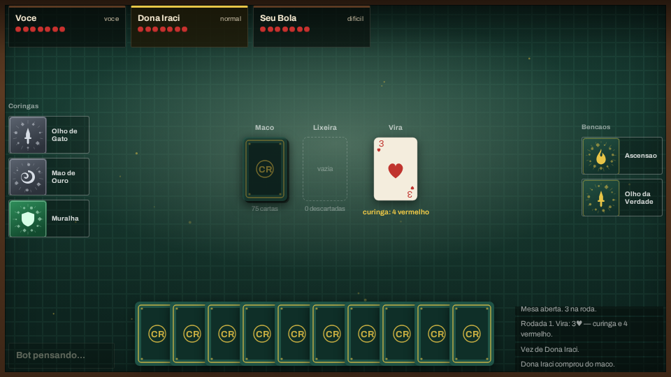
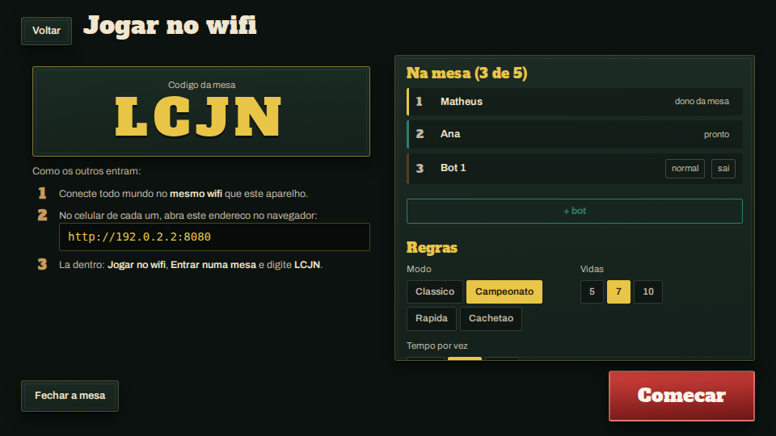
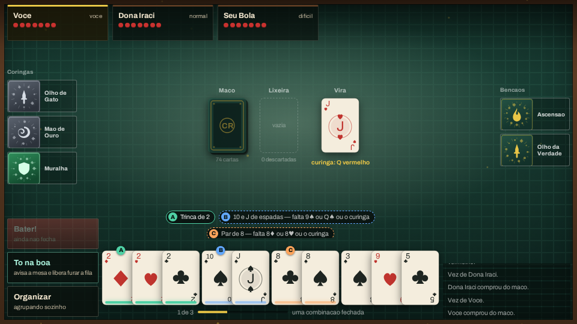
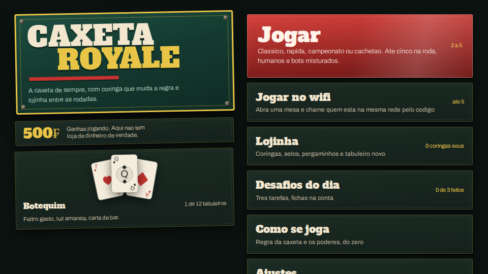
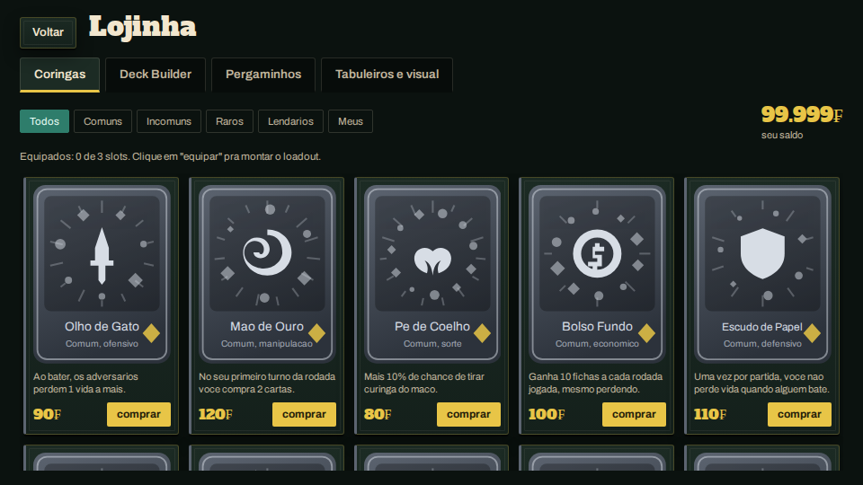
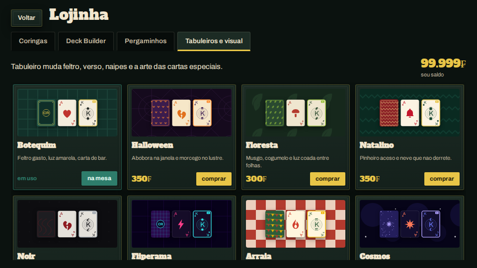
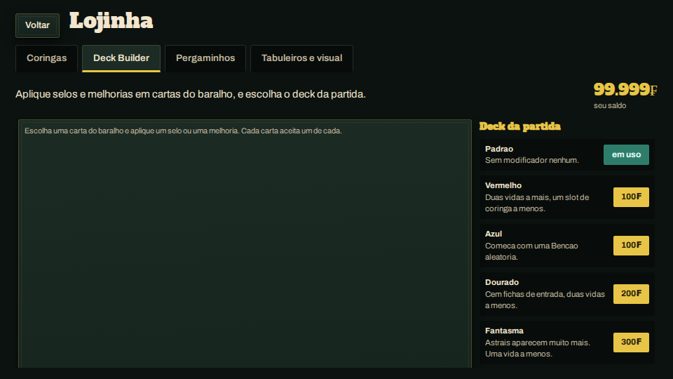
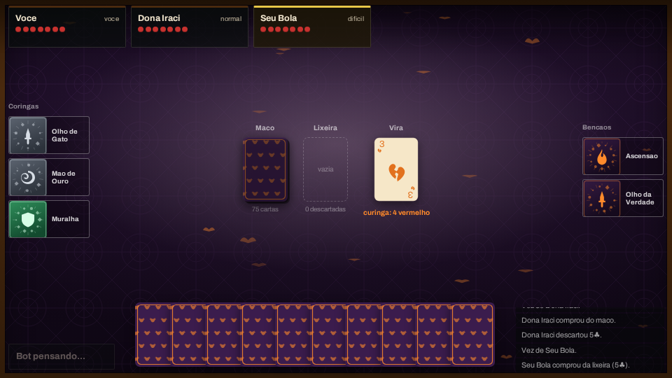
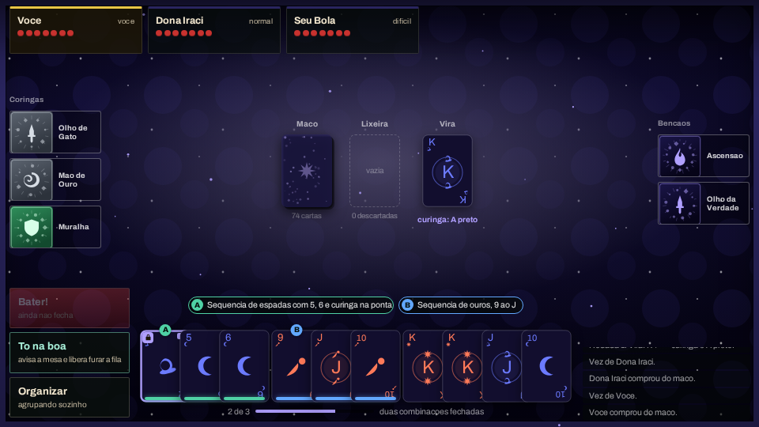

# Caxeta Royale

A caxeta brasileira com um sistema de poderes no espírito do Balatro: coringas especiais
que mudam a regra, bênçãos de uso único, cartas astrais que sobem de nível e uma lojinha
entre as rodadas. Roda no navegador e empacota como APK Android.



---

## Rodar agora

```bash
cd server
go run . -web ../web
# abre http://localhost:8080
```

O servidor Go é um file server com um endpoint de backup (`/api/save`). Toda a lógica do
jogo roda no cliente — dá pra abrir `web/index.html` direto no navegador que funciona igual.

## O APK

O workflow **APK** monta e publica o `app-debug.apk` a cada push. O build mais recente
está em [Actions → APK](https://github.com/Matensy/Caxetro/actions/workflows/apk.yml) —
abra o run e baixe o artefato `caxeta-royale-debug-apk` (o `.apk` vem dentro de um `.zip`).

Para montar na sua máquina:

```bash
cd android
./gradlew assembleDebug
# sai em android/app/build/outputs/apk/debug/app-debug.apk
```

O build copia `/web` para os assets do APK sozinho (task `copiarJogo`), então não existe
cópia duplicada do jogo no repositório. O APK é um WebView em tela cheia, travado em
paisagem, sem nenhuma permissão e sem acesso à rede. Requer Android 7.0 (API 24) ou
superior. O último build deu **985 KiB** — bem abaixo da meta de 10 MB do escopo.

Como é um APK de debug, o Android vai pedir permissão de "instalar app de fonte
desconhecida" na primeira vez.

---

## Jogar com os amigos no mesmo wifi

Quem abre a mesa vira o dono dela: o aparelho dele roda o jogo e distribui pra cada um
só o que aquele jogador pode ver. Os outros entram com um código de quatro letras.

```bash
cd server
go run . -web ../web
# o servidor imprime o endereço da rede, tipo http://192.168.0.12:8080
```

1. No aparelho que vai ser o dono: **Jogar no wifi → Abrir mesa**. Aparece o código.
2. Os amigos abrem aquele endereço no navegador do celular, no mesmo wifi.
3. Lá dentro: **Jogar no wifi → Entrar numa mesa**, digitam o código e pronto.



Dá pra misturar bots na mesa online. Nada sai pra internet, não tem conta e não tem
cadastro: a sala vive na memória do servidor e some quando o dono fecha.

Se alguém cair no meio da partida, a cadeira vira bot e o jogo continua.

**A mão de cada um fica no aparelho de cada um.** O dono não manda o estado inteiro pra
todo mundo — ele monta um retrato por jogador, e a mão alheia simplesmente não vai junto.
O `tools/test-lan.js` verifica isso a cada execução.

## O que tem dentro

| | |
|---|---|
| Coringas Especiais | 60 (25 comuns, 18 incomuns, 12 raros, 5 lendários) |
| Cartas de Bênção | 20 consumíveis |
| Cartas Astrais | 12 upgrades por nível |
| Selos e melhorias | 5 selos, 6 edições de carta |
| Pergaminhos | 16, cada um com versão avançada |
| Tabuleiros temáticos | 12, cada um com feltro, verso, naipes e arte própria |
| Decks com modificador | 10 |
| Cosméticos | 20 (animação de batida, moldura, tema de interface, som de batida) |
| Baralhos prontos | 6 combinações montadas, com resumo da estratégia |
| Modos | Clássico (sem poderes), Partida rápida, Campeonato, Cachetão |
| Bots | Iniciante, Normal, Difícil |
| Desafios diários | 3 por dia, sorteados de um bolo de 20 |

Moeda única: **Fichas (₣)**, ganhas jogando. Não existe compra com dinheiro de verdade.

---

## O organizador de mão

A mão se agrupa sozinha e escreve o que está acontecendo: *"Trinca de 7"*, *"Sequência de
espadas, 8 ao 10"*, *"Par de 6 — falta 6♥ ou o curinga"*. Cada grupo ganha uma cor, uma
letra e uma barra embaixo das cartas dele. Quando a combinação só fecha por causa do
curinga, a etiqueta diz isso na cara.

O curinga da rodada não pode ser descartado: ele aparece com um cadeado e o motor recusa
a jogada, o que vale também pros bots e pra qualquer cliente na rede.



## As regras que o motor implementa

- Dois baralhos, 104 cartas. Nove cartas por jogador, distribuídas uma a uma.
- **Vira e curinga**: a carta virada define o curinga da rodada — o valor imediatamente
  acima dela, na mesma cor. Vira K, curinga é o Ás da mesma cor. Um curinga por combinação
  (dois com o coringa Forja), e combinação só de curinga não vale.
- **Trinca**: três do mesmo valor em naipes diferentes; a 4ª e a 5ª carta só entram se o
  naipe já estiver na trinca.
- **Sequência**: três ou mais do mesmo naipe em ordem. Ás vale 1 (A-2-3) ou 14 (Q-K-A).
  K-A-2 é inválido.
- **Bater com 9** (3+3+3), **bater com 10** (4+3+3, uma combinação com ponta) e
  **mão batida** (já veio fechada na distribuição).
- **Tô na boa**, **furar a fila**, **queimar** e **pifar** (blefe).
- Penalidades: 1 vida ao bater com 9, 2 com 10, 3 na mão batida, 2 no flush completo.
- **Cachetão**: cada rodada começa com a escolha entre jogar e correr.
- Mesa travada (ninguém bate por 30 voltas) encerra a rodada empatada.

## Telas

| | |
|---|---|
|  |  |
|  |  |
|  |  |

Mais fotos em [docs/TELAS.md](docs/TELAS.md). Como o jogo em rede funciona por dentro:
[docs/REDE.md](docs/REDE.md).

---

## Como o código está organizado

```
web/js/
  core/      deck, regras, organizador de mão, jogador, controlador da partida
  net/       transporte da sala, espelho da partida, dono e convidado
  powers/    barramento de efeitos + coringas, bênçãos, astrais, selos, pergaminhos
  ai/        bots de três níveis
  shop/      catálogo, economia e desafios
  themes/    glifos dos naipes e os 12 tabuleiros
  render/    geração de SVG das cartas, partículas em canvas, tweens
  ui/        telas, mesa, utilitários de DOM
  save/      LocalStorage + espelho no servidor
```

Os módulos são scripts clássicos que penduram tudo num namespace `CR`, carregados em ordem
pelo `index.html`. Sem bundler e sem `type="module"`: assim o mesmo código roda em
`http://`, em `file://` e dentro do WebView do APK sem nenhuma etapa de build.

Nenhum poder é conhecido pelo nome dentro do motor. Cada um declara `mods` (modificadores
numéricos) e `on` (eventos), e o jogo só pergunta ao barramento em `powers/effects.js`.
Adicionar um coringa novo é escrever um objeto, não mexer nas regras.

### Decisões que fogem do escopo original

- **Cartas em DOM, feltro e partículas em Canvas.** O escopo pedia Canvas 2D para tudo. As
  cartas viraram SVG em elementos do DOM porque assim o texto fica nítido em qualquer
  densidade, o leitor de tela lê a carta e o foco por teclado funciona de graça. O canvas
  continua fazendo o que ele faz melhor: as partículas do tabuleiro e o estouro da batida.
- **Arte gerada, não desenhada à mão.** Os 60 coringas, as 20 bênçãos e as 12 astrais têm
  emblemas montados na hora a partir de um alfabeto de formas, com a semente vinda do id da
  carta. Dá 92 artes distintas e coerentes entre si, sem um único bitmap no pacote.

## Testes

```bash
node tools/test-rules.js    # 34 casos das regras da caxeta
node tools/test-needs.js    # cruza o cálculo de "na boa" com força bruta em 4000 mãos
node tools/test-sim.js 60   # 60 partidas só de bots, procurando travamento
node tools/test-ui.js       # joga uma partida inteira pelo DOM, no Chromium
node tools/test-lan.js     # dois navegadores numa sala: joga e confere que a mão não vaza
node tools/test-lan-queda.js  # um jogador some no meio: a cadeira vira bot e a mesa segue
node tools/screenshots.js   # regera as fotos de docs/imagens
```

`test-ui.js`, `test-lan.js` e `screenshots.js` precisam do servidor rodando em
`localhost:8080`. O `test-ui.js` aceita `CENARIO=classico|cachetao|hotseat|sempoderes`.

---

Escopo completo do produto em [docs/ESCOPO.md](docs/ESCOPO.md).
